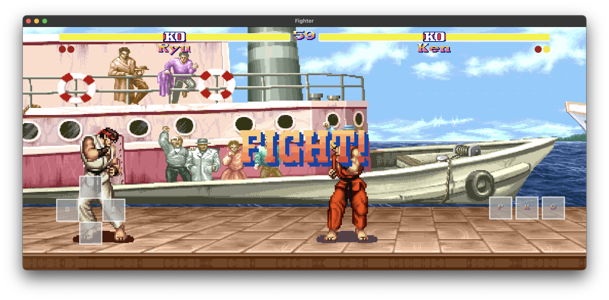

The code is built from a WSL Ubuntu Python venv so desktop and Android builds stay clean and repeatable.

# Retro System - 2D Fighter

An arcade-style 2D fighter built with Kivy. You get character/stage select, sprite-sheet animation, HUD, a lightweight AI opponent, and touch-friendly controls out of the box.



## Project tree
| Path | Description |
| --- | --- |
| `README.md` | This file. |
| `requirements.txt` | Python dependencies for desktop/dev. |
| `main.py` | Simple launcher for `FighterApp`. |
| `game_fighter/` | Game package with code. |
| `game_fighter/fighter_game.py` | Module entrypoint ([docs](docs/fighter_game.md)). |
| `game_fighter/fighter_app.py` | Kivy `App` bootstrap ([docs](docs/fighter_app.md)). |
| `game_fighter/game_widget.py` | Core game loop, input, UI, AI ([docs](docs/game_widget.md)). |
| `game_fighter/fighter.py` | Fighter model, movement, collisions ([docs](docs/fighter.md)). |
| `game_fighter/sprite_anim.py` | Sprite sheet helper ([docs](docs/sprite_anim.md)). |
| `game_fighter/input_manager.py` | Multi-source input aggregator ([docs](docs/input_manager.md)). |
| `game_fighter/constants.py` | Shared tuning values ([docs](docs/constants.md)). |
| `assets/` | Art, UI, stages, fonts. |
| `ryu_frames.json`, `ken_frames.json` | Frame metadata for slicing. |
| `docs/` | Module docs + build guide (`buildozer.md`). |
| `docs/gamescreenshot.png` | README screenshot. |
| `CONTROLS.txt` | Quick control reference. |
| `buildozer.spec` | Android build configuration ([docs](docs/buildozer.md)). |
| `tools/` | Helper scripts (`slice_sprites.py`, `atlas_inspect.py`). |
| `Individual_Game_Documentation.md` | Design/implementation notes. |
| `Game Showcase.mp4` | Sample gameplay video. |
| `.vscode/settings.json` | Editor settings. |
| `.gitignore` | Git ignores. |
| `_tmp/` | Scratch (ignored). |

## Quick start (desktop)
1. (Optional) create and activate a virtual environment.
2. Install deps:
   ```bash
   pip install -r requirements.txt
   # or: pip install kivy==2.2.1 pillow
   ```
3. Run from the repo root:
   ```bash
   python -m game_fighter.fighter_game
   # or: python game_fighter/fighter_game.py
   ```
4. Set `FIGHTER_DEBUG=1` to skip menus and jump straight into a match.

## Controls (touch is the default mode)
- Main menu: Left/Right (or tap) to toggle Keyboard/Controller vs Touch; Enter/Space or tap Play to continue.
- Character/Stage select: A/Left/Up and D/Right/Down (or tap) to choose; Enter/Space/tap to confirm.
- In match (keyboard): A/Left move, D/Right move, W/Up jump, J/Space attack, R restarts after match.
- In match (controller): Stick/D-pad to move; Up or A/Y jump; B/X attack; Start/Options confirms menus.
- In match (touch): On-screen D-pad (left) for movement/jump; right-side buttons for Punch (P), Kick (placeholder), Special (placeholder); tap match-over banner to restart.
- After match: R/Enter/Space restart; M/Esc/Backspace return to main menu.

## What’s inside
- `game_fighter/` gameplay package:
  - `fighter_game.py` entrypoint ([docs](docs/fighter_game.md)); `fighter_app.py` Kivy app bootstrap (uses native window size) ([docs](docs/fighter_app.md)); `game_widget.py` core game loop, menus, input (keyboard/controller/touch), camera, HUD, AI ([docs](docs/game_widget.md)); `fighter.py` fighter model and collisions ([docs](docs/fighter.md)); `sprite_anim.py` animation helper ([docs](docs/sprite_anim.md)); `input_manager.py` multi-source input aggregator ([docs](docs/input_manager.md)); `constants.py` shared tuning values ([docs](docs/constants.md)).
  - `assets/` art, UI, fonts, and stage layers.
  - `docs/` detailed module notes (see links above) plus `buildozer.md` for packaging.
  - `CONTROLS.txt` quick control reference.
  - `buildozer.spec` + `docs/buildozer.md` for Android packaging.
  - `tools/` helper scripts; `Game Showcase.mp4` sample footage; `Individual_Game_Documentation.md` design notes.

## Building for Android
See `docs/buildozer.md` for spec details, WSL/venv setup, required system packages, and `buildozer` commands.

## Tweaking the game
- AI pacing, hit/hurt boxes, and camera behavior live in `game_widget.py` and `constants.py`.
- Touch overlay sizing/padding can be tuned in `game_widget.py`.
- Add new moves by extending `fighter.py` and wiring inputs in `game_widget.py`.
